# PROJECT: HỆ THỐNG CÀI ĐẶT AVN(AUDIO, VIDEO, NAVIGATION) TRÊN Ô TÔ

- Project này sẽ có một hệ thống để quản lí thông tin các người dùng ô tô khi họ cài đặt hệ thống AVN cho xe.

### Thông tin về source code:

- Viết bằng ngôn ngữ C++ 
- Build trên Visual Studio IDE 2022.

### Project bao gồm các kiến thức đã sử dụng như:

- Nhập xuất dữ liệu
- Hàm, tham trị, tham chiếu
- Thiết lập thuật toán sắp xếp nổi bọt, tìm kiếm nhị phân
- STL container: vector
- Con trỏ nâng cao
- Các tính chất của hướng đối tượng: trừu trượng, đóng gói, kế thừa và đa hình
- Sử dụng regex để kiểm tra việc nhập dữ liệu có hợp lệ hay không hợp lệ
- Kiểm soát ngoại lệ (exception handling)
- Thao tác đọc ghi file.

## Cấu trúc hệ thống có:
* Mối quan hệ giữa các lớp được thể hiện bằng Class Diagram
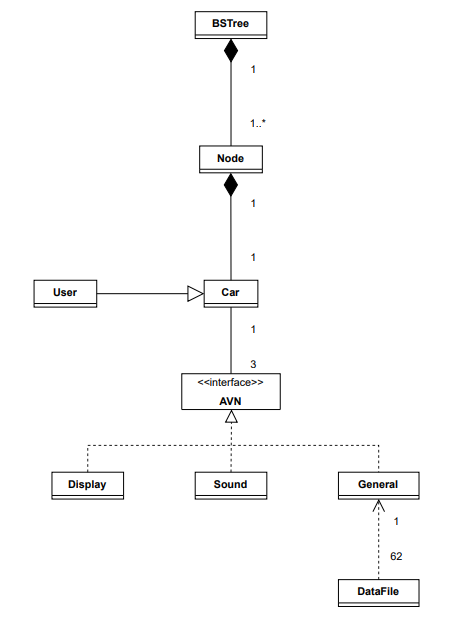
## Cấu trúc chương trình: 
Mỗi xe sẽ có các thông số như tên xe, mã số cá nhân, email người sử dụng, ODO, thông tin km cần đến để bảo dưỡng xe và 3 chức năng Display, Sound, General. Cụ thể như sau:
- Mảng vector<Car> ListVehicle là mảng toàn cục và mảng sẽ lưu các thông tin của xe. Các thao tác trên hệ thống sẽ thực hiện ở file main.cpp.
  - Display: Liên quan đến việc hiển thị trên màn hình và cài đặt các giá trị như Light level, Screen light level, Taplo light level.
  - Sound: Liên quan về hệ thống âm thanh và cài đặt các giá trị âm thanh cho: Media volume level, Call volume level, Navigation volume level,Notification volume level.
  - General: Gồm các cài đặt chung cho hệ thống AVN như Timezone, Language.

## Chức năng:
- Input Information
- Output Information
- Search Information
- Erase Information

### 1. Chức năng tải các thông tin từ file Setting.txt để cập nhật các xe được lưu trong file khi chương trình bắt đầu:
- Nếu có thông tin thì thực hiện đọc file và đưa dữ liệu vào chương trình để thực hiện cập nhật và hiển thị dữ liệu theo các chức năng:

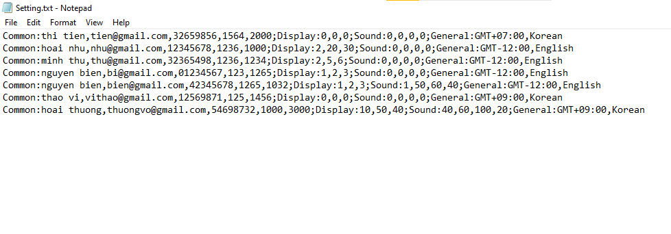

Thông báo cập nhật thành công:

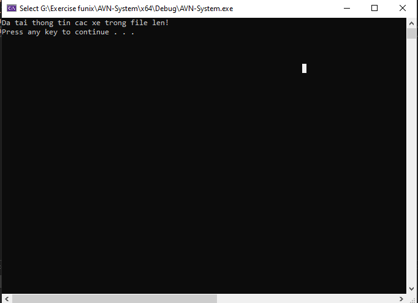

- Nếu không cập nhật thành công hoặc không có thông tin file thì hiển thị:

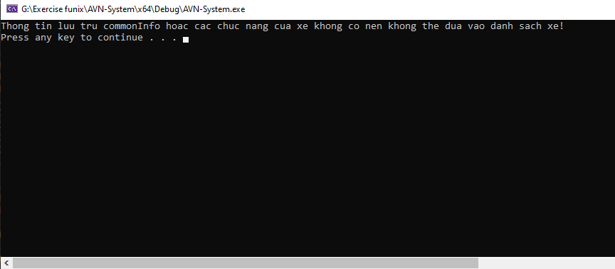

- Chức năng còn cập nhật danh sách vào file khi ta nhập thông tin của xe vào hệ thống hoặc xóa thông tin xe ra khỏi hệ thống.

### 2. Nhập thông tin các xe trong hệ thống: 
- Đưa ra màn hình lựa chọn nhập một trong ba chức năng Display, Sound hoặc General:

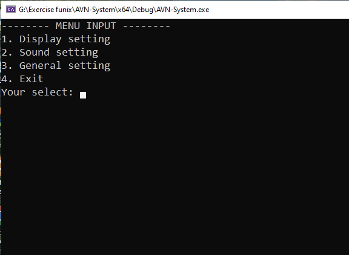
  
- Khi lựa chọn nhập thông tin Display, Sound hoặc General thì sẽ nhập thông tin của người dùng trước tiên. Khi đã nhập hoàn tất thông tin người dùng, chương trình sẽ biết được sẽ có tồn tại trong hệ thống hay chưa bằng cách so sánh với MSCN trong danh sách xe. Nếu MSCN của người dùng trùng với MSCN đã có trong danh sách thì cập nhật lại thông tin người dùng trong danh sách.
Dưới đây là nhập thông tin General của người dùng đầu tiên:

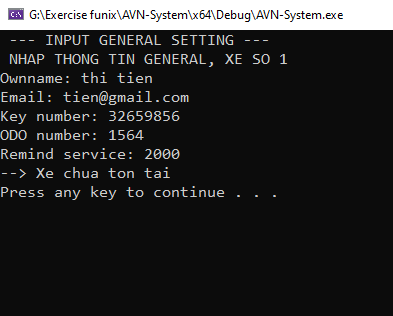

- Sau đó, khi lựa chọn nhập thông tin General sẽ hiển thị một bảng lựa chọn múi giờ và ngôn ngữ được tải lên từ file Timezone.txt và Language.txt để cho người dùng lựa chọn
  - Timezone và Language:
  
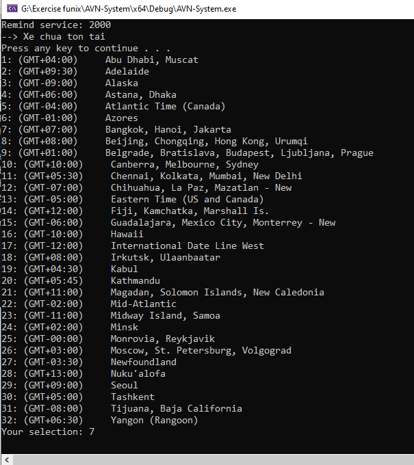 

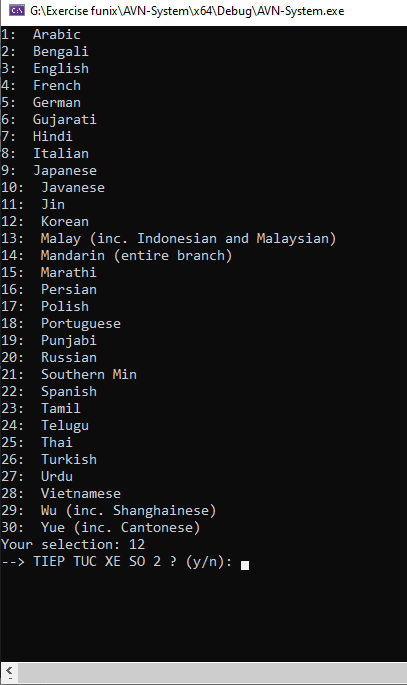
    
- Khi nhập xong một trong ba thông tin trên thì thông tin của người dùng đó đã được lưu vào hệ thống. Các thông tin chưa nhập vào sẽ có giá trị mặc định là 0 và các giá trị timezone, language được mặc định là GMT+07:00, English:
  
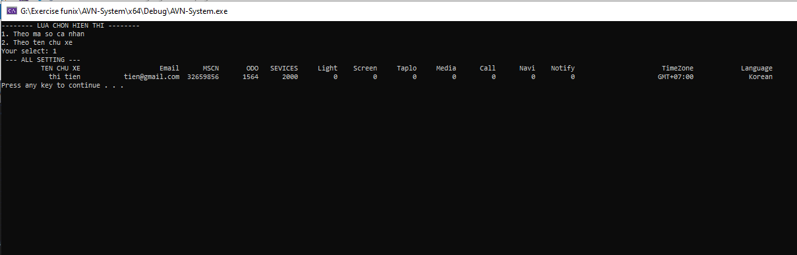

- Đồng thời, các thông tin của xe sẽ được cập nhật và đồng bộ với file Setting.txt để có thể tải lên vào lần chạy chương trình tới:
  
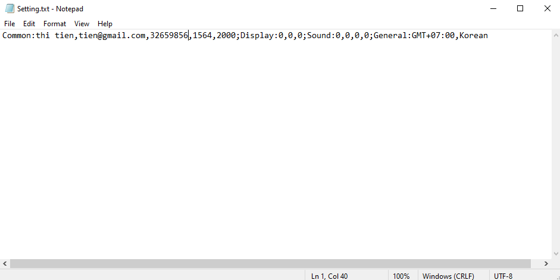

- Khi nhập xong sẽ quay lại màn hình lựa chọn nhập, xuất. Nếu lựa chọn nhập thông tin một lần nữa và nhập thông tin người dùng xe thì ta lại kiểm tra MSCN của người dùng đó đã có trong danh sách hay không. Nếu không thì xác nhận đó là xe mới. Dưới đây là nhập thông tin Display ở xe số 2:
  
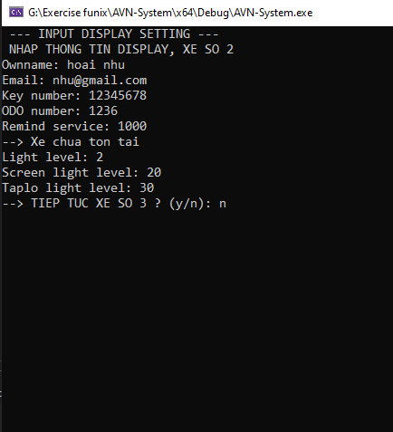

- Xe số 2 đã được thêm vào danh sách đồng thời nó cũng cập nhật vào file Setting.txt. Dưới đây là thông tin hiển thị theo MSCN của xe trong chương trình bây giờ:
  
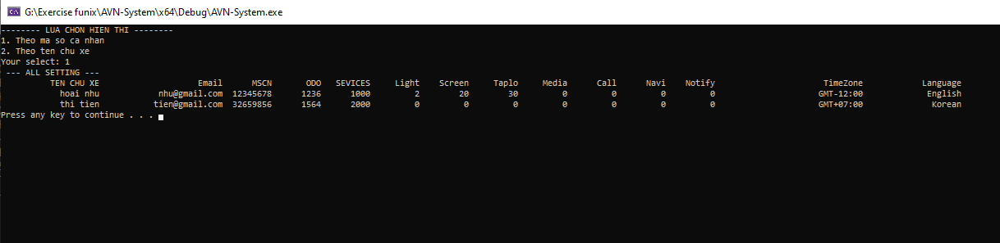

### 3. Xuất thông tin các xe trong hệ thống: 
- Khi lựa chọn hiển thị thông tin các xe trong danh sách, ta đến màn hình lựa chọn hiển thị 1 trong 4 lựa chọn như:
Lựa chọn tương ứng sẽ hiển thị ra thông tin người dùng tương ứng:
  - Hiển thị thông tin người dùng và display.  
  - Hiển thị thông tin người dùng và sound
  - Hiển thị thông tin người dùng và general.  
  - Hiển thị tất cả thông tin người dùng.
    
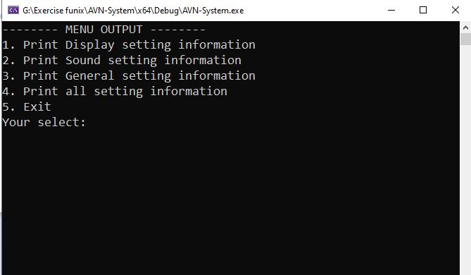

- Nếu danh sách xe đang trống, thông báo sẽ hiển thị:
  
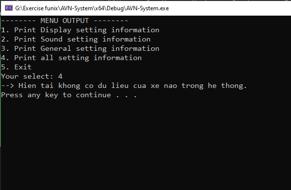

- Sau khi nhập xe số 1 và xe số 2, ta sẽ nhập lần lượt các xe mà ta muốn và hiển thị lên màn hình như sau:
Hiển thị Display(Sound, General tương tự):

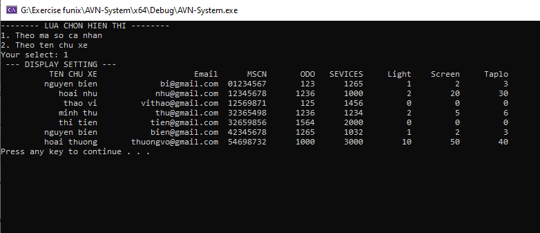

Hiển thị tất cả các thông tin:

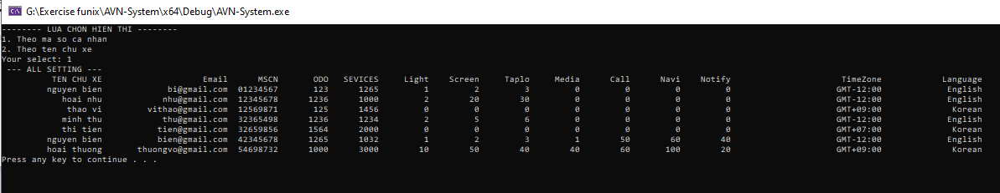

### 4. Tìm kiếm thông tin các xe trong hệ thống:
- Tìm kiếm thông tin xe bằng 2 cách: tìm kiếm dựa trên mã số cá nhân của chủ xe (PersonalKey) hoặc tên chủ xe(Car name)

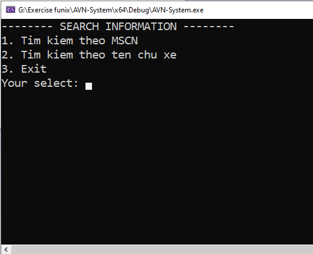

- Cài đặt thuật toán sắp xếp nổi bọt để sắp xếp các phần tử của mảng vector dựa theo 2 giá trị trên trước khi tìm kiếm phần tử bằng thuật toán tìm kiếm nhị phân
- Cài đặt thuật toán tìm kiếm nhị phân để trả về vị trí phần tử đầu tiên trong vector trùng với giá trị cần tìm
- Nếu danh sách xe đang trống, thông báo sẽ được hiển thị:
  
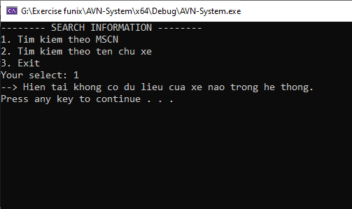

- Hiển thị thông tin xe dựa trên MSCN chỉ có 1 thông tin xe:
  
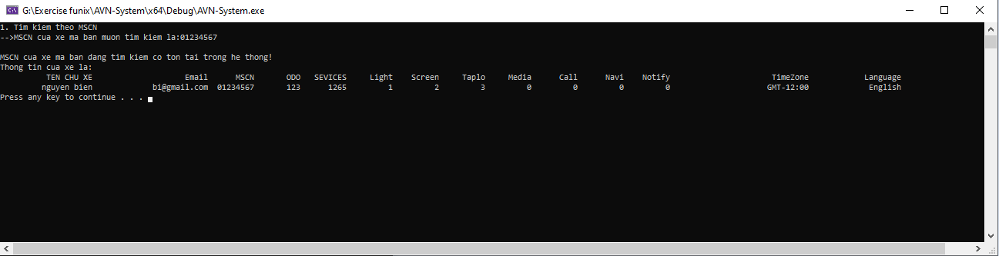

- Hiển thị thông tin xe dựa trên tên chủ xe có thể có 1 hoặc nhiều thông tin của các xe:
  
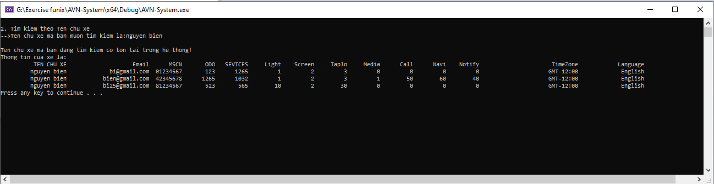

### 5. Xóa thông tin xe trong hệ thống: 
- Nhập thông tin MSCN của chủ xe muốn xóa khỏi hệ thống:
  
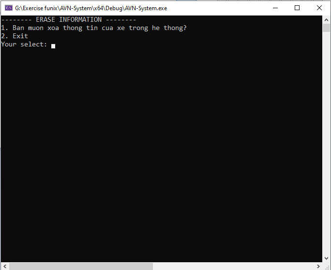

- Nếu danh sách xe đang trống, thông báo sẽ được hiển thị:
  
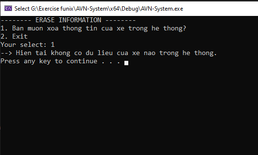

- Cài đặt thuật toán sắp xếp nổi bọt để sắp xếp các phần tử của mảng vector dựa theo MSCN của xe trước khi tìm kiếm phần tử bằng thuật toán tìm kiếm nhị phân
- Cài đặt thuật toán tìm kiếm nhị phân để trả về vị trí phần tử đầu tiên trong vector trùng với giá trị cần tìm
  - Dưới đây là thông tin xe muốn xóa trong danh sách:
  
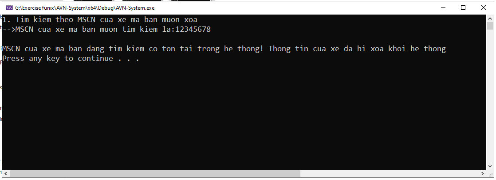

Để kiểm tra xe đã xóa hay chưa, chỉ cần tìm kiếm hoặc hiển thị danh sách tất cả các xe. Dưới đây là tìm kiếm thông tin xe trước khi xóa:

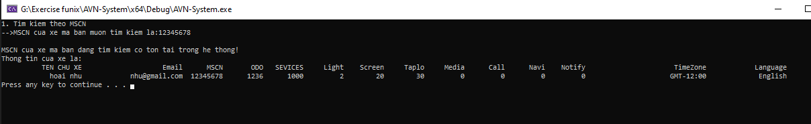

Còn đây là tìm kiếm xe sau khi đã xóa:

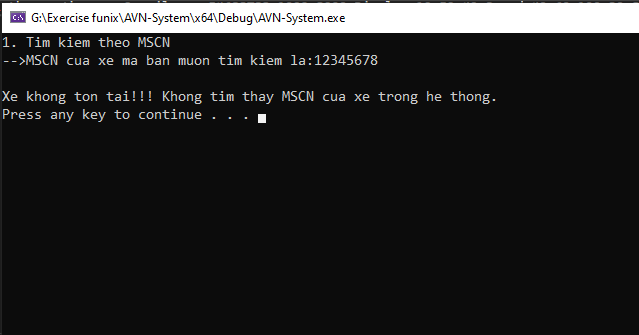

Tuy nhiên, thông tin xe muốn xóa nếu không có trong danh sách thì không thể xóa:
  
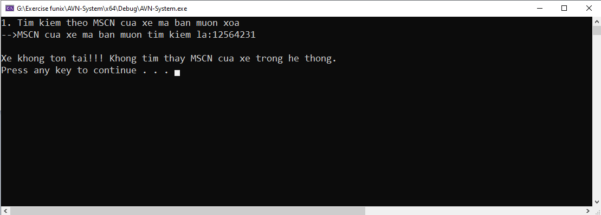

- Khi biết được vị trí của xe cần xóa trong mảng thì swap vị trí của xe muốn xóa cho vị trí cuối cùng trong mảng.
- Lưu ý: Khi xóa 1 phần tử trong vector, các phần tử đằng sau sẽ lần lượt chèn về phía trước và điều chỉnh kích thước của vector. Việc swap này chính xóa vị trí của xe ngay tại vị trí trả về và đưa các phần tử Car về phía trước. Vì thế, việc swap xe có vị trí cần xóa về vị trí cuối cùng là việc xóa thông tin xe để thao tác xóa trong vector được dễ dàng hơn. Đồng thời, mảng vector không cần dồn các phần tử đằng sau nó về phía trước để điều chỉnh kích thước nữa. Do đó, việc này tránh việc sao chép và gán quá nhiều lần ở đối tượng Car trong mảng vector. Dưới đây là thể hiện quan hệ của các đối tượng con thuộc đối tượng Car qua hàm hủy ~Car():
  
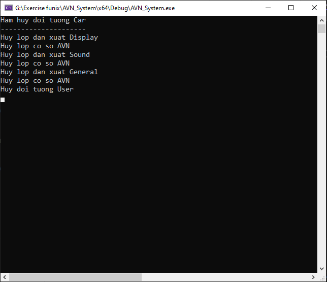

